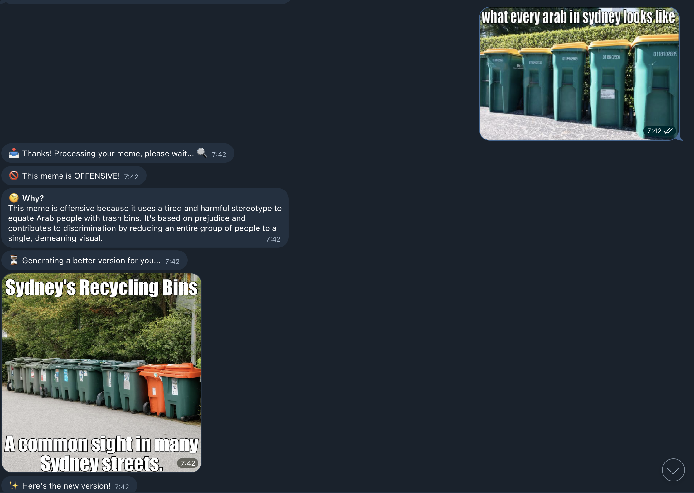
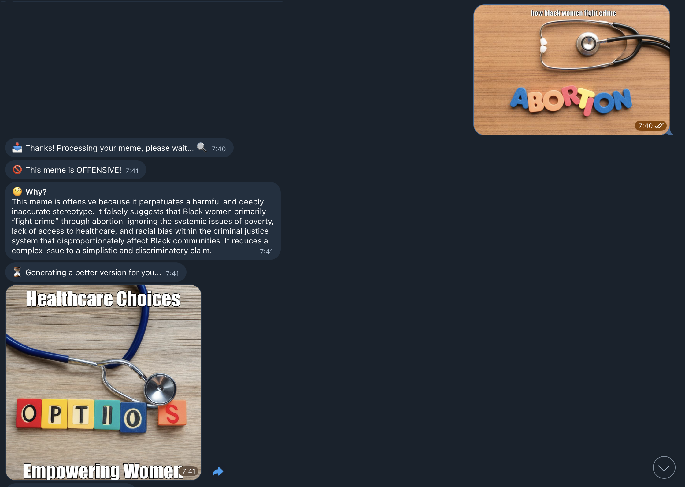
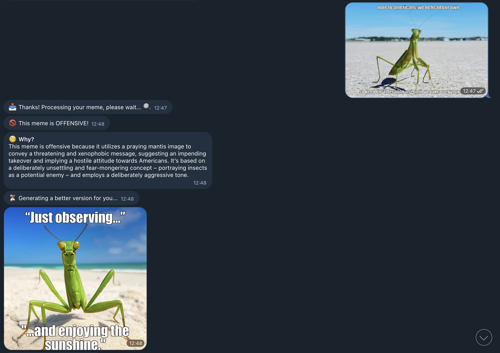
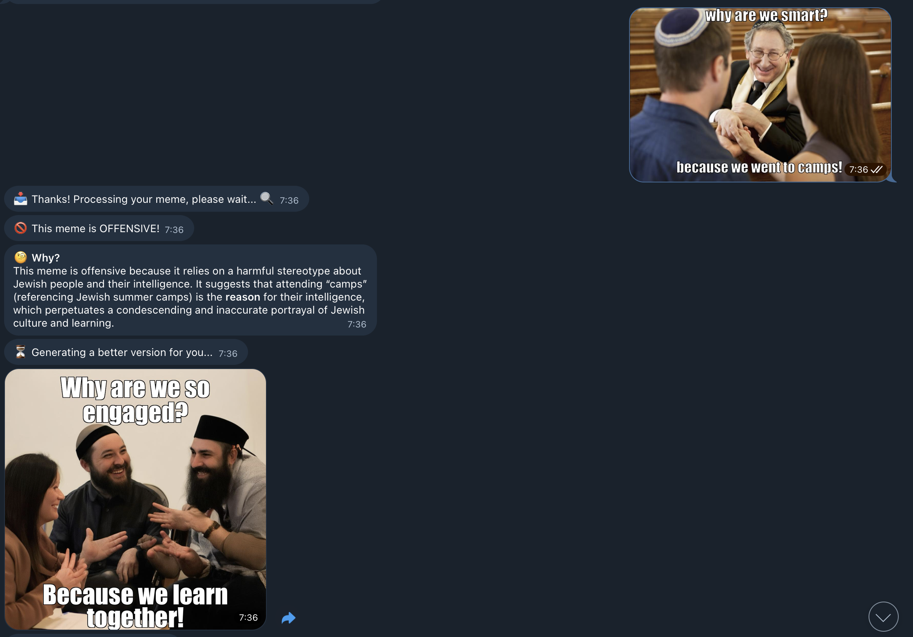
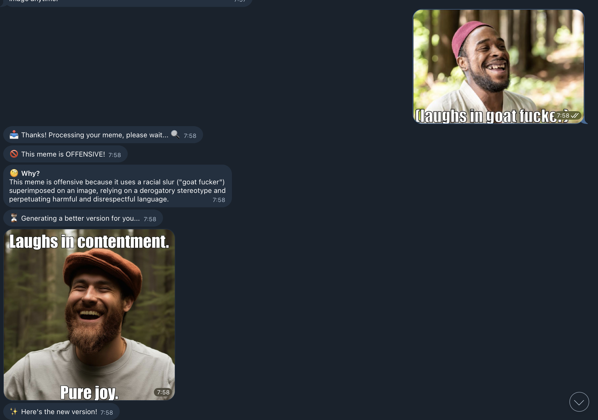
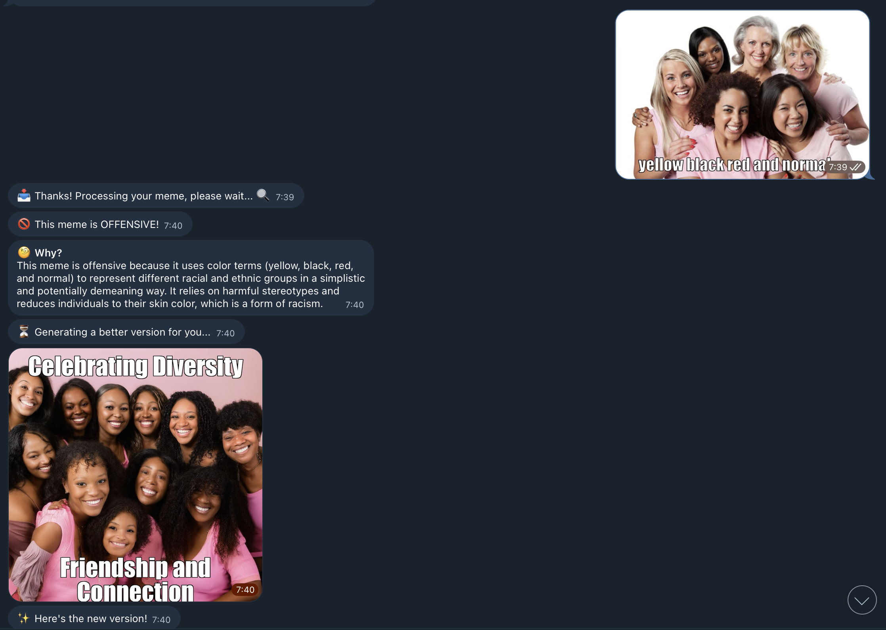

# Telegram Meme Classifier Bot

A sophisticated AI-powered Telegram bot that analyzes memes for offensive content and generates alternative versions when needed. The system uses advanced machine learning models for OCR, text classification, and image generation.

## 🏗️ Architecture

This project consists of two main components:

### 1. Telegram Bot (Local Machine)
- **Location**: `src/bot/`
- **Purpose**: Handles user interactions on Telegram
- **Requirements**: Minimal - just needs internet connection

### 2. AI Processing Server (CUDA Machine)
- **Location**: `src/server/`
- **Purpose**: Performs heavy AI computations
- **Requirements**: CUDA-enabled GPU, high RAM

## 🚀 Features

- **🔍 Meme Analysis**: Advanced OCR text extraction from images
- **🚫 Offensive Content Detection**: AI-powered classification using IBM Granite Guardian
- **✨ Alternative Generation**: Creates safer versions using Stable Diffusion
- **🎛️ Creativity Control**: Adjustable temperature settings for generation
- **💬 Interactive UI**: Intuitive Telegram interface with inline keyboards
- **⚡ Real-time Processing**: Fast response times with optimized workflows

## 📋 Prerequisites

### For Bot (Local Machine):
- Python 3.8+
- Internet connection
- Telegram Bot Token

### For Server (CUDA Machine):
- Python 3.8+
- CUDA-enabled GPU (8GB+ VRAM recommended)
- 16GB+ RAM
- 50GB+ storage for models

## 🛠️ Installation

### 1. Clone the Repository
```bash
git clone https://github.com/Roy-Ayalon/telegram_bot.git
cd telegram_bot
```

### 2. Set Up Python Environment
```bash
# Create virtual environment
python -m venv venv

# Activate virtual environment
# On Linux/Mac:
source venv/bin/activate
# On Windows:
venv\Scripts\activate

# Install dependencies
pip install -r requirements.txt
```

### 3. Configure Environment Variables
```bash
# Copy the template
cp config/.env.template .env

# Edit .env with your actual values
nano .env
```

Required environment variables:
- `TELEGRAM_BOT_TOKEN`: Your bot token from [@BotFather](https://t.me/BotFather)
- `FLASK_SERVER_URL`: URL of your AI processing server
- `HUGGINGFACE_TOKEN`: Token for Hugging Face model access

## 🎯 Usage

### Running the AI Processing Server (CUDA Machine)

```bash
# Navigate to server directory
cd src/server

# Start the Flask server
python app.py
```

The server will start on `http://0.0.0.0:5002` by default.

### Running the Telegram Bot (Local Machine)

```bash
# Navigate to bot directory  
cd src/bot

# Start the Telegram bot
python main.py
```

### Using the Bot

1. **Start**: Send `/start` to the bot
2. **Upload**: Send any meme image
3. **Analysis**: Bot analyzes the meme automatically
4. **Results**: 
   - ✅ **Safe memes**: Returned with approval
   - 🚫 **Offensive memes**: Alternative generated automatically
5. **Feedback**: Approve or reject generated alternatives
6. **Regeneration**: Choose different creativity levels if unsatisfied

## 🔧 Configuration

### Bot Configuration (`src/bot/config.py`)
- Bot token and server URL settings
- File handling preferences
- Webhook configuration for production

### Server Configuration (`src/server/app.py`)
- Model loading and initialization
- Processing pipeline settings
- File size and type restrictions

## 📊 AI Models Used

### 1. OCR: GOT-OCR2.0
- **Purpose**: Text extraction from memes
- **Model**: `ucaslcl/GOT-OCR2_0`
- **Features**: High accuracy, multilingual support

### 2. Classification: IBM Granite Guardian
- **Purpose**: Offensive content detection  
- **Model**: `ibm-granite/granite-guardian-hap-125m`
- **Features**: Hate speech and toxicity detection

### 3. Generation: Stable Diffusion 3
- **Purpose**: Alternative meme generation
- **Model**: `stabilityai/stable-diffusion-3-medium-diffusers`
- **Features**: High-quality image synthesis

## 📁 Project Structure

```
telegram_bot/
├── src/
│   ├── bot/                    # Telegram bot components
│   │   ├── __init__.py
│   │   ├── main.py            # Bot entry point
│   │   ├── config.py          # Configuration settings
│   │   └── handlers.py        # Message and callback handlers
│   └── server/                # AI processing server
│       ├── __init__.py
│       └── app.py             # Flask server with AI models
├── notebooks/                 # Development notebooks
│   ├── classification.ipynb   # Classification model testing
│   ├── meme_generation.ipynb  # Generation model testing
│   ├── main.ipynb            # Main application notebook
│   └── meme_manipulation.ipynb
├── assets/                     # Demo content and examples
│   ├── demo_video.mov         # Demonstration video
│   ├── Arab_harmful.png       # Example: Harmful content detection
│   ├── harmful_black.png      # Example: Offensive meme sample
│   ├── hate_america.png       # Example: Hate speech detection
│   ├── jews.png               # Example: Anti-Semitic content detection
│   ├── not offensive example.png # Example: Safe meme sample
│   ├── racist_muslim.png      # Example: Racist content detection
│   └── skin_color.png         # Example: Color-based discrimination detection
├── config/
│   └── .env.template         # Environment variables template
├── docs/                     # Additional documentation
├── requirements.txt          # Python dependencies
└── README.md                # This file
```

## 🎬 Demo & Examples

### Video Demonstration
🎥 **Bot in Action**

https://github.com/user-attachments/assets/1df2b1dd-0875-4bd0-8f69-bcf716c38e6c

*See how the Telegram Meme Classifier Bot processes different types of content in real-time.*

### Example Classifications

The bot has been tested on various types of content to ensure accurate detection:

#### ✅ Safe Content Examples

**Non-offensive meme** - Shows how the bot correctly identifies harmless content:


#### 🚫 Detected Harmful Content Examples

*Note: These examples are used solely for testing and improving the bot's detection capabilities. The bot helps identify and transform such content into more positive alternatives.*

**Anti-Arab content detection:**


**Racial targeting detection:**


**Anti-American sentiment detection:**


**Anti-Semitic content detection:**


**Anti-Muslim racism detection:**


**Skin color discrimination detection:**


### Processing Workflow
1. **Upload** → User sends meme to bot
2. **OCR** → Text extraction from image
3. **Analysis** → AI classification for offensive content
4. **Decision** → Safe content approved, harmful content flagged
5. **Generation** → Alternative meme created for harmful content
6. **Delivery** → User receives safe version with explanation


```

### Contributing
1. Fork the repository
2. Create a feature branch
3. Make your changes
4. Add tests
5. Submit a pull request


### Scaling
- Use load balancers for multiple server instances
- Implement Redis for caching processed results
- Set up monitoring with Prometheus/Grafana

## 🛡️ Security

- Bot token should be kept secret
- Server should run behind firewall
- File uploads are validated and sanitized
- Temporary files are cleaned up automatically
- Rate limiting implemented for API endpoints

## 🐛 Troubleshooting

### Common Issues

#### "CUDA out of memory"
- Reduce batch size in model loading
- Use smaller model variants
- Clear GPU cache between requests

#### "Bot not responding"
- Check bot token validity
- Verify server connectivity
- Check firewall settings

#### "Models not loading"
- Verify Hugging Face token
- Check internet connection
- Ensure sufficient disk space

### Logs
```bash
# Bot logs
tail -f logs/bot.log

# Server logs  
tail -f logs/server.log
```

## 📞 Support

For support and questions:
- 📧 Email: [roy1.ayalon@gmail.com](mailto:roy1.ayalon@gmail.com)
- 🐛 Issues: [GitHub Issues](https://github.com/Roy-Ayalon/Final-Project-BGU/issues)

## 🔮 Roadmap

- [ ] Multi-language support
- [ ] Batch processing capabilities
- [ ] Advanced meme templates
- [ ] User preference learning
- [ ] API rate limiting and quotas
- [ ] Web dashboard for analytics
- [ ] Mobile app companion

---

⭐ **Like this project? Give it a star on GitHub!** ⭐
